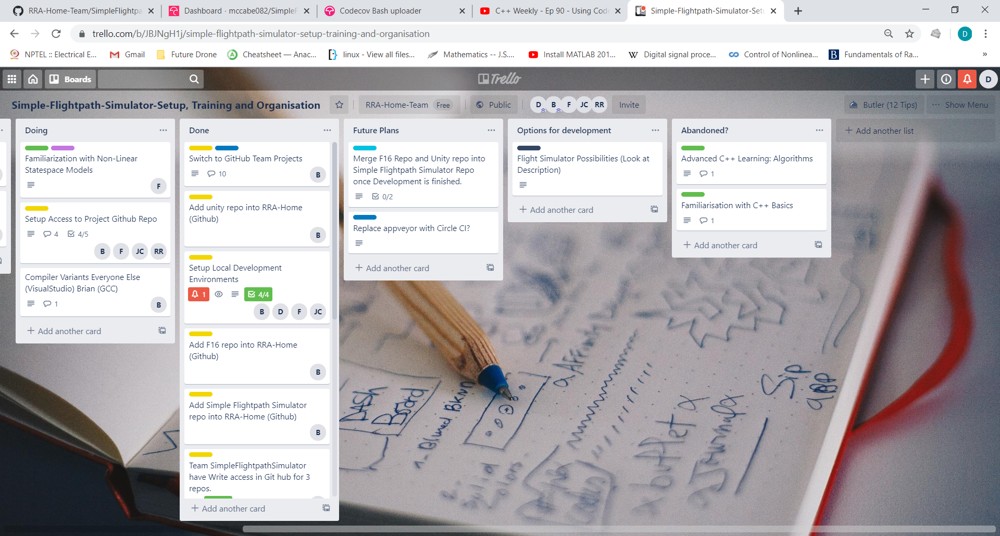
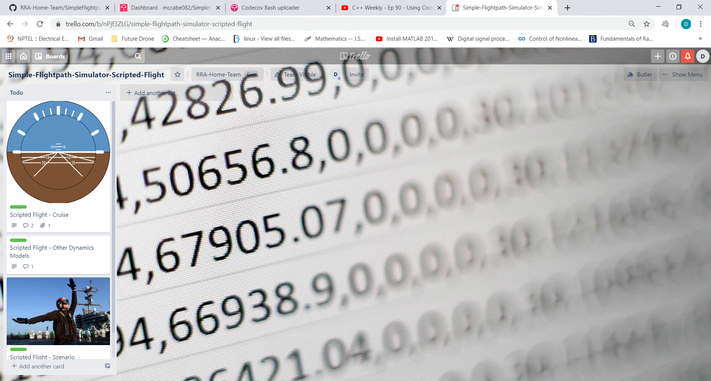
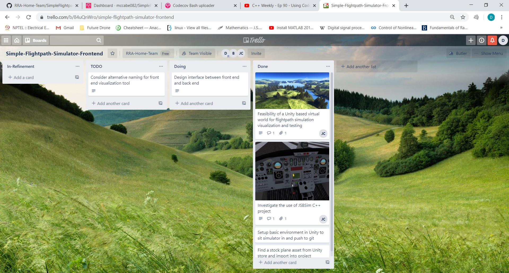

# Simple Flightpath Simulator

A desktop application for simulating aircraft in three dimensions.

---

## Group's Collective Objectives...
The RRA Team are currently working on a collaborative C++ project on home PCs with the goal of writing a simple engine for simulating Radar Targets. This is an innovation project with opportunities to experience software development from a non-restricted application based development perspective.

Interpersonal/Team Objectives: 
- Trial free software for remote communication and collaboration 
- Building inter-team awareness and broadening college support networks
- Share knowledge/interests in areas related to the Software/Radar domain 
- Develop using easy to use open-source cloud based tools
- *Keep work fun* and everyone motivated 

Technical/Company Objectives: 
- Developing and diversifying our c++ expertise; C++11 or above, GSL... 
- Practice reuse of commercial grade public C++ libraries 
- Trial some architecture we were hoping to use in our commercial code
- Produce some work which might be useful

## Programme Structure
|**Lean Software Process** | 
|---|
| |
Has been the main focus of the programme so far
- Establishing ways of working remotely using home PCs
  - *Communication* using WhatsApp, [Discord](https://discord.gg/6zMa4Tp) and [WebEx](https://selex-es.webex.com/selex-es/j.php?MTID=m992415bfae7c0d8952ab784b2ff517f1)
  - *Colaborative development* through a [Github Organisation](https://github.com/RRA-Home-Team) and a [Trello Team](https://trello.com/simpleflightpathgeneratorteam/home)
- Utilising thirdparty automation tools an ultra lean development process
  - *No documented protocall/process* - carte blanche unless physically constrained
    - Disallow unreviewed commits through github
    - Prohibit failing unit tests through githooks
    - Cleaner code throught the use of a C++ [Core Guidelines](https://isocpp.github.io/CppCoreGuidelines/CppCoreGuidelines) "checker"
  - *Feedback* - Peer review, Continuous Integration, Retrospectives, Code Coverage, Test Driven Development etc... Transparency->Introspection->Adaption

|**Basic Target Simulation**|
|---|
| |
Planning a system for chaining together a sequence of predefined manouvers;
- straight and level cruise
- climb/decent
- constant rate turn
- corkscrew...

|**Target Playback**| 
|---|
||
Developing a system for analysing generated target data intuitively;
- Unity Framework for visualising numerical output
- investigation into other respected C++ projects, specifically, [FlightGear](https://en.wikipedia.org/wiki/FlightGear) and [JSBSim](https://en.wikipedia.org/wiki/JSBSim)
 
|**Flight Simulator**|
|---|
||
(Stretch) Developing a data driven flight simulator in C++;
- Writing a reasonably sophisticated flight simulator which is controllable from Unity

>**Note**: This project attempts to follow a [prescribed directory layout](https://api.csswg.org/bikeshed/?force=1&url=https://raw.githubusercontent.com/vector-of-bool/pitchfork/develop/data/spec.bs)

> **Note**: This project currently requires [Boost 1.71.0](https://www.boost.org/users/history/version_1_71_0.html)
