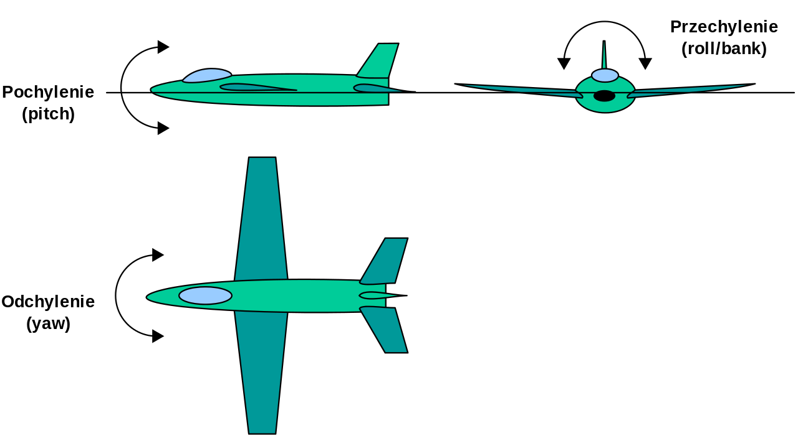
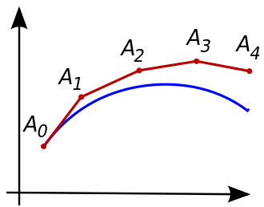

# **Dynamic Simulation of Aircraft**

### **Preliminary Reading/Viewing**

- Introduction to [state space models](https://www.youtube.com/watch?v=hpeKrMG-WP0)
- Introduction to [initial value problems](https://www.khanacademy.org/math/ap-calculus-bc/bc-differential-equations-new/bc-7-5/v/eulers-method)

---
## **Representing the <a href="#state">State</a> of an Aircraft**
The *state*, $\bar{X}$ of an aircraft is represented by a single point in a *state space*:

$$\hat{X}= [x,y,z,\theta,\phi,\psi,\ldots]^T$$

where the symbols correspond to:
- Earth Cartesian coordinates, $[x , y, z]^T$
- Roll angle, $\phi$
- Pitch angle, $\theta$
- Yaw angle, $\psi$
- $\ldots$ any other vars to characterise the state

---
## **Representing the <a href="#dynamics">Dynamics</a> of an Aircraft**
Aircraft dynamics are modelled using a system of Ordinary Differential Equations (ODEs).  In our case, these are a series of non-linear functions, $f_i$:

 Translation | Rotation | Other...
 :---:       | :---:    | :---:
$\dot{x}=f_1(\hat{X})$ | $P=f_4(\hat{X})$ | $\ldots$
$\dot{y}=f_2(\hat{X})$ | $Q=f_5(\hat{X})$ | $\ldots$
$\dot{z}=f_3(\hat{X})$ | $R=f_6(\hat{X})$ | $\ldots$

where
- Roll rate, $P\equiv\dot{\phi}$
- Pitch rate, $Q\equiv\dot{\theta}$ 
- Yaw rate, $R\equiv\dot{\psi}$

The functions collecively describe the system of the aircraft.  They can be complicated but can be found online.  They don't need to be understood as they are conceptually simple to understand in terms of their input and and output.

#### Model Input
- the state vector, $\hat{X}= [x,y,z,\theta,\phi,\psi,\ldots]^T$
- the current variables characterising the aircraft's current *state*

#### Model Output
- the derivative of the state vector, $\dot{\hat{X}}= [\dot{x},\dot{y},\dot{z},P,Q,R,\ldots]^T$
- the variables characterising how the aircraft's state is currently changing

---
## **<a href="#simulating">Simulating</a> the Motion of an Aircraft**

The aircraft can be simulated over time, $t$ by numerically integrating the ODEs:

- given an aircraft in an initial <a name="state">state</a> $\hat{X}_0$ a point in (state) space
- we can calculate the derivitive of the state using <a name="dynamics">the non-linear dynamics</a> which is a vector in space.
- we can simulate the motion of the aircraft by jumping discretely to the next state

This involves applying a numerical integration technique such as but not limited to; Eular's method, Matlab's [ode45](https://uk.mathworks.com/help/matlab/math/choose-an-ode-solver.html), [RK4]( https://en.wikipedia.org/wiki/Runge%E2%80%93Kutta_methods), [odeint](https://www.boost.org/doc/libs/1_66_0/libs/numeric/odeint/doc/html/index.html)...

---
## Further Reading

- [Introduction to
6-DOF Simulation of
Air Vehicles](http://avionics.nau.edu.ua/files/doc/VisSim.doc/6dof.pdf)
